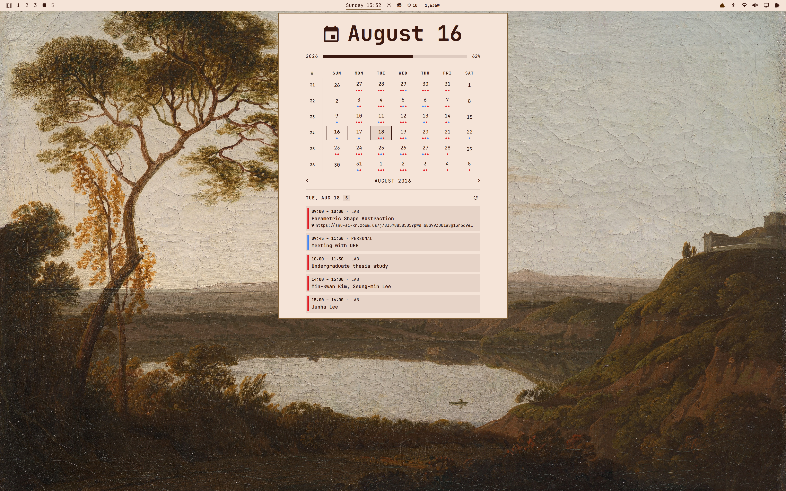
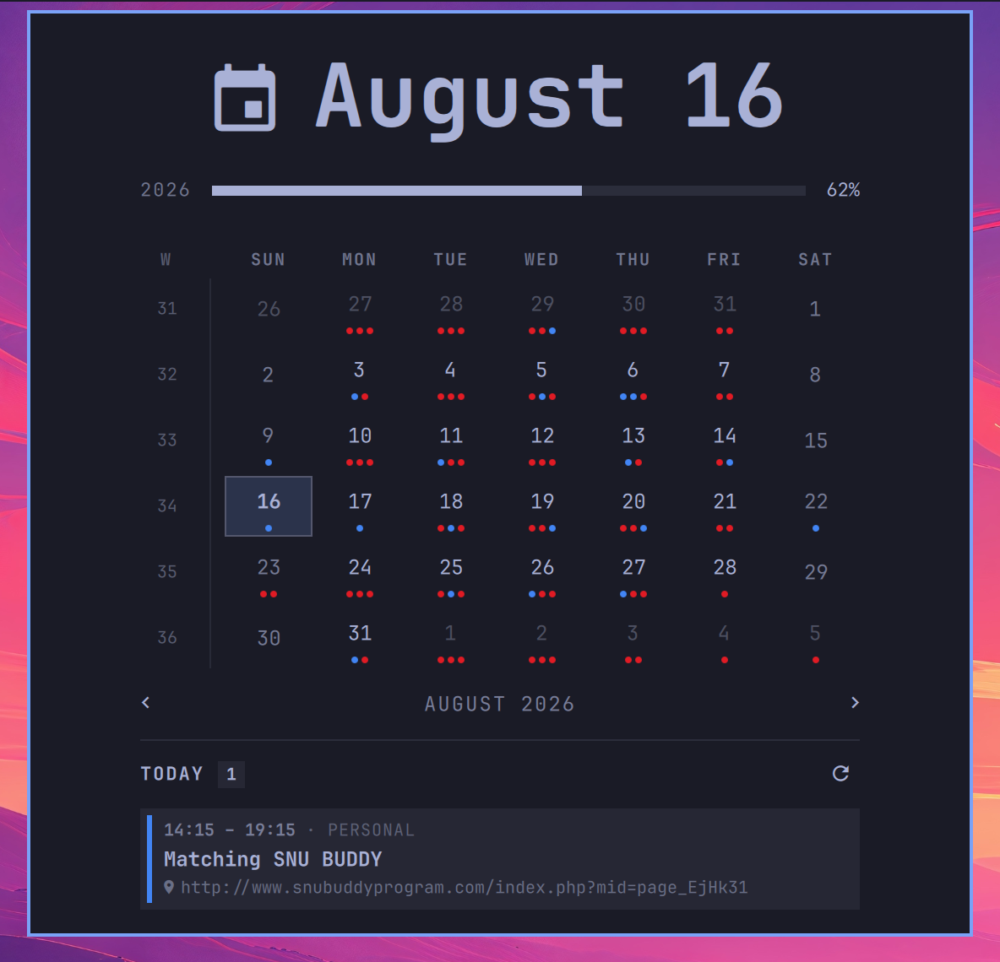
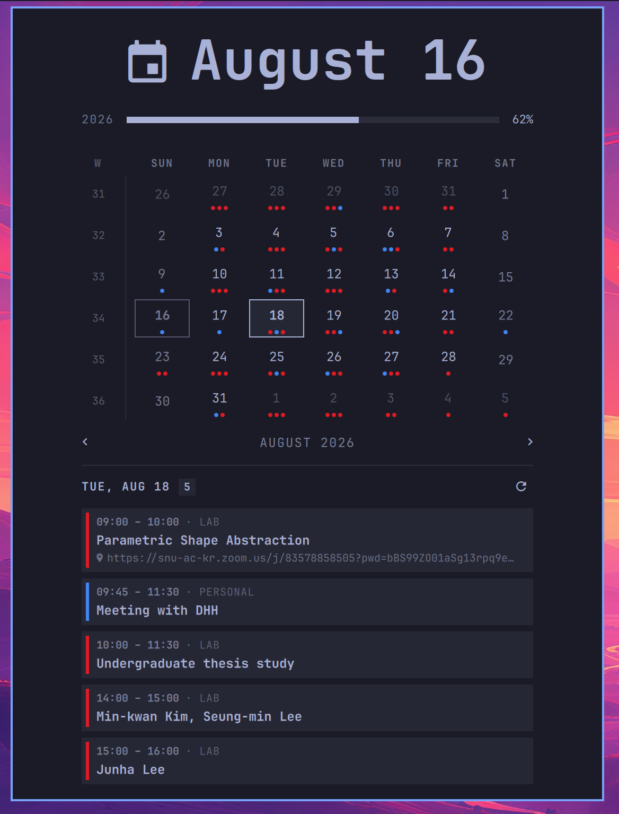

# Google & Apple Calendar Sync

A lightweight calendar and clock status bar plugin for Omarchy to sync Google and Apple calendars directly into your desktop.




## Gallery

| Preview | View |
| --- | --- |
|  | Single event view |
|  | Multi-calendar agenda view |

## Features

- **Seamless Theming**: Dynamically inherits your active Omarchy theme colors, fonts, and styling.
- **Multi-Calendar Sync**: Connect multiple Google Calendars (private iCal or API) and Apple iCloud feeds simultaneously.
- **Interactive Month Grid**: Click any date to view scheduled events for that day.
- **Visual Event Indicators**: Days with events show subtle colored dots on the month grid.
- **Automatic Korean Translation**: Pre-translates Hangul titles and locations into English with persistent local caching.
- **Fast & Non-Blocking**: Background multi-threaded event fetcher with zero UI freezes.
- **Recurring Events**: Full support for daily, weekly, monthly, and yearly recurring events (`RRULE` / `EXDATE`).

## Installation

Clone or install the plugin:

```bash
omarchy plugin add https://github.com/promaaa/sync-calendar-omarchy.git --enable
```

### OR

1. Open the Omarchy menu (**Super + Alt + Space**).
2. Go to **Install > Plugins**.
3. Paste this repo URL: `https://github.com/promaaa/sync-calendar-omarchy.git`

4. Hit Enter.

## Configuration

Configure your calendar feeds in `~/.config/omarchy/calendars.json`:

```json
[
  {
    "name": "Personal",
    "url": "https://calendar.google.com/calendar/ical/your_email%40gmail.com/private-xxxxxxxxxxxxxxxx/basic.ics",
    "color": "#4285f4",
    "enabled": true
  },
  {
    "name": "Work / Lab",
    "googleCalendarId": "your_calendar_id@group.calendar.google.com",
    "color": "#e01b24",
    "translateKorean": true,
    "enabled": true
  },
  {
    "name": "Apple iCloud",
    "url": "webcal://pXX-caldav.icloud.com/published/2/xxxxxxxx",
    "color": "#30d158",
    "enabled": true
  }
]
```

Edits to `calendars.json` hot-reload automatically without restarting the shell.

## Getting Calendar Links

### Google Calendar (Private iCal)
1. Open [Google Calendar](https://calendar.google.com/) on the web.
2. In the left sidebar, hover over your calendar $\rightarrow$ click **Settings and sharing**.
3. Scroll down to **Integrate calendar** $\rightarrow$ Copy the **Secret address in iCal format**.

### Google Calendar API (Shared / Restricted Calendars)
For non-public calendars where you don't own the private iCal link:
1. Set your `googleCalendarId` in `calendars.json`.
2. Run the one-time authentication script:
   ```bash
   python3 ~/.config/omarchy/plugins/promaa.clock/google-auth.py
   ```

### Apple iCloud Calendar
1. Open [iCloud Calendar](https://www.icloud.com/calendar) or macOS Calendar.
2. Click the **Share** icon next to the calendar $\rightarrow$ Turn on **Public Calendar**.
3. Copy the `webcal://...` link.

## Contributing

Contributions, bug reports, feature requests, and suggestions are welcome. Feel free to open an issue or submit a pull request.

## License

This project is licensed under the MIT License. See the [LICENSE](LICENSE) file for details.
