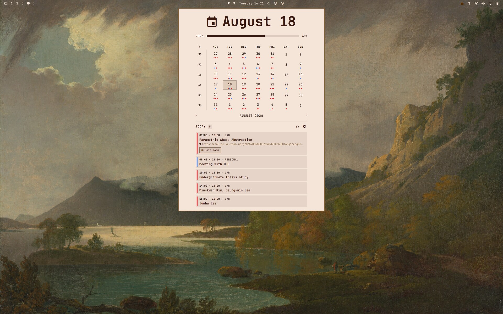

# Calendar Sync for Omarchy

A fast, lightweight calendar and clock status bar plugin for Omarchy that syncs Google Calendar, Apple iCloud, Proton Calendar, Microsoft Outlook, Nextcloud, and generic iCalendar (.ics / webcal) feeds directly into your desktop.




## Gallery

| Preview | View |
| --- | --- |
|  | Several events in one day |
|  | Preferences menu |

## Features

- **Universal iCalendar Support**: Compatible with any calendar service providing an `.ics` / `webcal://` link (Google, Apple iCloud, Proton, Outlook / Office 365, Nextcloud, Fastmail, or local `.ics` files).
- **One-Click "Join Meeting"**: Automatically detects Google Meet, Zoom, Microsoft Teams, Webex, and Jitsi links in event details and displays an instant join button.
- **Desktop Notifications**: Native alerts prior to upcoming meetings and appointments with configurable notice times (5m, 10m, 15m, 30m).
- **Configurable Auto-Sync & Instant Refresh**: Customizable background sync intervals (5m, 15m, 30m, 60m, or manual) plus an instant sync button with real-time status.
- **Seamless Theming**: Dynamically inherits your active Omarchy theme colors, fonts, and styling.
- **Multi-Calendar Sync**: Connect multiple calendar accounts and feeds with customizable per-calendar colors and easy enable/disable toggles.
- **Interactive Month Grid**: Click any date to view scheduled events for that day.
- **Visual Event Indicators**: Days with events show subtle colored dots corresponding to the calendar source.
- **Fast & Non-Blocking**: Background multi-threaded event fetcher with zero UI freezes.
- **Recurring & Multi-Day Events**: Full support for daily, weekly, monthly, and yearly recurring events (`RRULE` / `EXDATE`) and multi-day spans.

## Installation

The one-command installer clones the plugin, enables it, removes the built-in
`omarchy.clock` it replaces, and re-centers the bar on the new widget:

```bash
git clone https://github.com/promaaa/sync-calendar-omarchy.git
cd sync-calendar-omarchy
./install.sh
```

Or, in a single line:

```bash
curl -fsSL https://raw.githubusercontent.com/promaaa/sync-calendar-omarchy/main/install.sh | bash
```

You can also install with the Omarchy CLI alone (this only adds the plugin;
it does not remove the built-in clock):

```bash
omarchy plugin add https://github.com/promaaa/sync-calendar-omarchy.git --enable --yes
```

### Via GUI

1. Open the Omarchy menu (**Super + Alt + Space**).
2. Go to **Install > Plugins**.
3. Paste the repository URL: `https://github.com/promaaa/sync-calendar-omarchy.git`
4. Hit Enter.

## Configuration

Configure your calendar feeds and preferences using the in-app **Settings Menu (`󰒓`)** or directly in `~/.config/omarchy/calendars.json`:

```json
[
  {
    "name": "Google Calendar",
    "url": "https://calendar.google.com/calendar/ical/your_email%40gmail.com/private-xxxxxxxxxxxxxxxx/basic.ics",
    "color": "#4285f4",
    "enabled": true
  },
  {
    "name": "Proton Calendar",
    "url": "https://calendar.proton.me/api/calendar/v1/url/xxxxxxxx/calendar.ics",
    "color": "#6d4aff",
    "enabled": true
  },
  {
    "name": "Apple iCloud",
    "url": "webcal://pXX-caldav.icloud.com/published/2/xxxxxxxx",
    "color": "#30d158",
    "enabled": true
  },
  {
    "name": "Outlook / Office 365",
    "url": "https://outlook.live.com/owa/calendar/xxxxxxxx/calendar.ics",
    "color": "#0078d4",
    "enabled": true
  },
  {
    "name": "Nextcloud / CalDAV",
    "url": "https://nextcloud.example.com/remote.php/dav/public-calendars/xxxxxxxx?export",
    "color": "#0082c9",
    "enabled": true
  }
]
```

Edits to `calendars.json` hot-reload automatically without restarting the shell.

## Getting Calendar Links

### Google Calendar (Private iCal)
1. Open [Google Calendar](https://calendar.google.com/) on the web.
2. In the left sidebar, hover over your calendar $\rightarrow$ click the three dots $\rightarrow$ **Settings and sharing**.
3. Scroll down to **Integrate calendar** $\rightarrow$ Copy the **Secret address in iCal format**.

### Apple iCloud Calendar
1. Open [iCloud Calendar](https://www.icloud.com/calendar) or Apple Calendar on macOS / iOS.
2. Click the **Share** icon next to the calendar $\rightarrow$ Turn on **Public Calendar** (or share link).
3. Copy the `webcal://...` link.

### Proton Calendar
1. Open [Proton Calendar](https://calendar.proton.me/) on the web.
2. Go to **Settings** $\rightarrow$ **Calendars** $\rightarrow$ Click **Share** next to the calendar.
3. Under **Share outside Proton**, click **Create link** (choose Full details) and copy the `.ics` link.

### Microsoft Outlook / Office 365
1. Open [Outlook on the web](https://outlook.live.com/calendar/).
2. Go to **Settings (`󰒓`)** $\rightarrow$ **Calendar** $\rightarrow$ **Shared calendars**.
3. Under **Publish a calendar**, select your calendar and permissions $\rightarrow$ Click **Publish** $\rightarrow$ Copy the **ICS** link.

### Nextcloud / ownCloud / Fastmail / Generic iCal
1. In your calendar web interface, open calendar settings / sharing options.
2. Look for **Public link**, **Subscription link**, or **Export / iCal link** (`.ics` or `webcal://`).
3. Paste the URL into the plugin settings.

### Google Calendar API (Restricted Shared Calendars)
For private Google workspace or group calendars where you cannot access an iCal URL:
1. Set `"googleCalendarId": "your_calendar_id@group.calendar.google.com"` in `calendars.json`.
2. Run the one-time authentication helper:
   ```bash
   python3 ~/.config/omarchy/plugins/promaa.clock/google-auth.py
   ```

## Contributing

Contributions, bug reports, and suggestions are welcome. Feel free to open an issue or submit a pull request!

## License

This project is licensed under the MIT License. See the [LICENSE](LICENSE) file for details.
